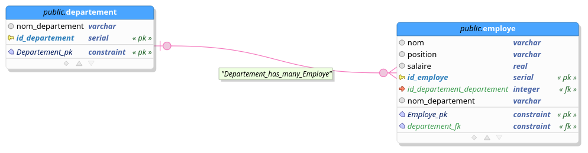

# Requêter une Base de Données avec SQL

## Introduction

Le Structured Query Language (SQL) est un langage standardisé pour gérer et manipuler les bases de données relationnelles. Il permet d'effectuer des opérations telles que l'extraction, l'insertion, la mise à jour ou la suppression de données, ainsi que la gestion de la structure des bases de données.

---

## Concepts de Base

### Les Bases de Données Relationnelles

Une base de données relationnelle est une collection organisée de tables où chaque table contient des données structurées sous forme de lignes et de colonnes.
<figure markdown="span">
    


<figcaption>Diagram</figcaption>
</figure>

### Syntaxe SQL

Une commande SQL est généralement structurée comme suit :
```sql
SELECT colonne1, colonne2
FROM table
WHERE condition;
```


Chaque mot-clé (SELECT, FROM, WHERE) correspond à une étape de l'extraction des données.

## Requêtes SQL de Base
### 1. Sélection des Données
SELECT permet d extraire  les colones d une table par exemple pour selectionner toutes les colones d une table :

```sql
   SELECT * FROM employees;

```

```bash

koffi   | directeur                |  120000 |          1 |                           
 Smith   | Analyste                 |   60000 |          2 |                           
 Johnson | Développeur              |   55000 |          3 |                           
 Garcia  | Manager                  |   70000 |          4 |                           
 Chen    | Ingénieur                |   65000 |          5 |                           
 Lopez   | Spécialiste des ventes   |   75000 |          6 |                           
 Singh   | Consultant               |   80000 |          7 |                           
 Müller  | Assistant                |   50000 |          8 |                           
 Ali     | Chef de projet           |   90000 |          9 |                           
 Kim     | Designer                 |   60000 |         10 |                           
 Nguyen  | Analyste financier       |   85000 |         11 |                           
 Rossi   | Développeur web          |   70000 |         12 |                           
 Gomes   | Administrateur système   |   65000 |         13 |                           
 Mahmoud | Directeur des opérations |  100000 |         14 |                           
 Jansen  | Gestionnaire de projet   |   95000 |         15 |                           
 Kumar   | Chef de produit          |   80000 |         16 |

```
Extraire des colonnes spécifiques :


```sql
   SELECT name, position FROM employees;

```

```bash

koffi   | directeur
 Smith   | Analyste
 Johnson | Développeur
 Garcia  | Manager
 Chen    | Ingénieur
 Lopez   | Spécialiste des ventes
 Singh   | Consultant
 Müller  | Assistant
 Ali     | Chef de projet
 Kim     | Designer
 Nguyen  | Analyste financier
 Rossi   | Développeur web
 Gomes   | Administrateur système
 Mahmoud | Directeur des opérations
 Jansen  | Gestionnaire de projet
 Kumar   | Chef de produit

```

## 2. Filtrer les Données avec WHERE
Exemples :
### Filtrer par une condition simple :
```sql
   SELECT * FROM employe
WHERE position='Designer';

```
```bash
 Kim | Designer |   60000 |         10 |
```


### Combiner des conditions avec AND et OR :
```sql
  
select * from employe
 where position='Analyste' and salaire>50000;
```
```bash
Smith | Analyste |   60000 |          2 |
```


## 3. Trier les Résultats

Utilisez ORDER BY pour trier les données :

```sql
   select nom, salaire
    from employe order by
     salaire desc;
```
```bash  
koffi   |  120000
 Mahmoud |  100000
 Jansen  |   95000
 Ali     |   90000
 Nguyen  |   85000
 Singh   |   80000
 Kumar   |   80000
 Lopez   |   75000
 Garcia  |   70000
 Rossi   |   70000
 Chen    |   65000
 Gomes   |   65000
 Smith   |   60000
 Kim     |   60000
 Johnson |   55000
 Müller  |   50000
```

## Fonctions et Opérations SQL Avancées
### Agrégation avec GROUP BY
 
Les fonctions d'agrégation (comme SUM, AVG, MAX) sont utilisées pour effectuer des calculs sur des groupes de données.

Exemple :
Calculer le salaire moyen par département :

```sql
   SELECT position, AVG(salaire) AS average_salary
FROM employe
GROUP BY position;


```
```bash
Directeur des opérations |         100000
 Designer                 |          60000
 Gestionnaire de projet   |          95000
 Chef de produit          |          80000
 Développeur              |          55000
 Administrateur système   |          65000
 Analyste financier       |          85000
 Manager                  |          70000
 Ingénieur                |          65000
 Spécialiste des ventes   |          75000
 Consultant               |          80000
 Développeur web          |          70000
 Analyste                 |          60000
 Assistant                |          50000
```

### 2. Limiter le Nombre de Résultats

Utilisez LIMIT pour restreindre le nombre de lignes retournées :

```sql
   select nom , salaire
    from employe 
    order by salaire 
    desc limit 5

```

```bash
Mahmoud | Directeur des opérations |  100000 |         43 |                          4
 Jansen  | Gestionnaire de projet   |   95000 |         44 |                          3
 Nguyen  | Analyste financier       |   85000 |         40 |                          3
 Singh   | Consultant               |   80000 |         36 |                          3
 Kumar   | Chef de produit          |   80000 |         45 |                          2

```

### 1. Les Joins
Les jointures permettent de relier des tables en utilisant des colonnes communes.

Exemple 1 : Jointure Interne (INNER JOIN)

```sql
   SELECT e.nom,
       d.nom_departement
FROM employe e
INNER JOIN departement d
ON e.id_departement = d.id_departement;

```
```bash
Smith   | Ressources Humaines
 Johnson | Marketing
 Garcia  | Informatique
 Chen    | Finance
 Lopez   | Finance
 Singh   | Marketing
 Müller  | Ressources Humaines
 Ali     | Développement
 Kim     | Finance
 Nguyen  | Marketing
 Rossi   | Développement
 Gomes   | Ressources Humaines
 Mahmoud | Finance
 Jansen  | Marketing
 Kumar   | Développement

```

Exemple 2 : Jointure Gauche (LEFT JOIN)


```sql
  select e.nom,
   d.nom_departement 
   from employe e left join departement 
   d on e.id_departement_departement=id_departement;

```
```bash
Smith   | Ressources Humaines
 Johnson | Marketing
 Garcia  | Informatique
 Chen    | Finance
 Lopez   | Finance
 Singh   | Marketing
 Müller  | Ressources Humaines
 Ali     | Développement
 Kim     | Finance
 Nguyen  | Marketing
 Rossi   | Développement
 Gomes   | Ressources Humaines
 Mahmoud | Finance
 Jansen  | Marketing
 Kumar   | Développement
 
```
### 2. Sous-Requêtes

Une sous-requête est une requête imbriquée dans une autre.

Exemple :
Trouver les employés ayant un salaire supérieur à la moyenne :


```sql
SELECT nom, salaire
FROM employe
WHERE salaire > (SELECT AVG(salaire) FROM employe);
```
```bash
Lopez   |   75000
 Singh   |   80000
 Ali     |   90000
 Nguyen  |   85000
 Mahmoud |  100000
 Jansen  |   95000
 Kumar   |   80000
```
## Modifier les Données
### 1. Ajouter des Données
Utilisez INSERT pour insérer de nouvelles lignes dans une table.

Exemple :
```sql
   INSERT INTO employees (name, position, salary, department_id)
VALUES ('Alice', 'Manager', 75000, 2);


```
### 2. Mettre à Jour des Données
Utilisez UPDATE pour modifier des données existantes.

Exemple :

```sql
  update employe
   set salaire = 80000 
   where nom='jansen';
```

### 3. Supprimer des Données
Utilisez DELETE pour supprimer des données.

Exemple :

```sql
  DELETE FROM employees
WHERE name = 'Alice';

```
## Bonnes Pratiques

Toujours tester les requêtes dans un environnement de développement.
Utiliser des transactions pour effectuer des modifications importantes 

## Cas d'Utilisation Concret
Scénario : Gestion d'une Entreprise
Base de Données :
employees : contient des informations sur les employés.
departments : contient des informations sur les départements.

Objectif :
### 1. Lister les noms des employés avec leur département.

```sql
  SELECT e.name, d.department_name
FROM employees e
INNER JOIN departments d
ON e.department_id = d.id;


```
### 2. Trouver les départements avec plus de 10 employés.


```sql
  SELECT d.department_name, COUNT(e.id) AS employee_count
FROM departments d
INNER JOIN employees e
ON d.id = e.department_id
GROUP BY d.department_name
HAVING COUNT(e.id) > 10;

```
### 3. Augmenter de 5% le salaire des employés du département "IT".

```sql
 UPDATE employees
SET salary = salary * 1.05
WHERE department_id = (SELECT id FROM departments WHERE department_name = 'IT');


```
